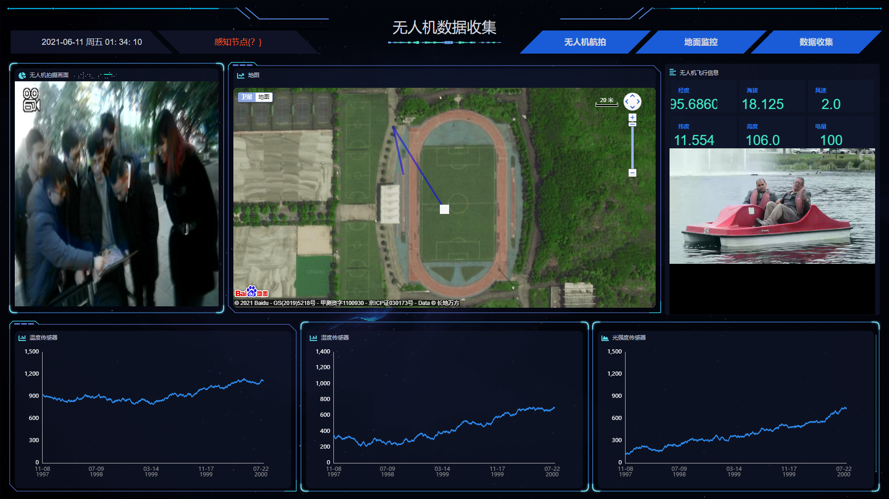

## 一、项目描述

- 一个基于 Vue、Datav、Echart 框架的无人机数据采集展示，通过 Vue 组件实现数据动态刷新渲染，内部图表可实现自由替换。部分图表使用 DataV 自带组件，可进行更改.

- 项目需要全屏展示（按 F11）。
- 项目环境：
    "axios": "^0.21.1",
    "core-js": "^3.6.5",
    "videojs-flash": "^2.2.1",
    "vue": "^2.6.11",
    "vue-router": "^3.2.0",
    "vue-video-player": "^5.0.2",
    "vuex": "^3.4.0",
    "@jiaminghi/data-view": "^2.10.0",
    "@vue/cli-plugin-babel": "~4.5.0",
    "@vue/cli-plugin-eslint": "~4.5.0",
    "@vue/cli-plugin-router": "~4.5.0",
    "@vue/cli-plugin-vuex": "~4.5.0",
    "@vue/cli-service": "~4.5.0",
    "babel-eslint": "^10.1.0",
    "echarts": "^4.6.0",
    "eslint": "^6.7.2",
    "eslint-plugin-vue": "^6.2.2",
    "sass": "^1.34.1",
    "sass-loader": "^7.0.3",
    "vue-awesome": "^4.3.1",
    "vue-baidu-map": "^0.21.22",
    "vue-template-compiler": "^2.6.11"


友情链接：

1.  [Vue 官方文档](https://cn.vuejs.org/v2/guide/instance.html)
2.  [DataV 官方文档](http://datav.jiaminghi.com/guide/)
3.  [echarts 实例](https://echarts.apache.org/examples/zh/index.html)，[echarts API 文档](https://echarts.apache.org/zh/api.html#echarts)
4.  [项目 gitee 地址（国内速度快）](https://gitee.com/MTrun/big-screen-vue-datav)

项目展示



## 二、主要文件介绍

| 文件                | 作用/功能                                                              |
| ------------------- | --------------------------------------------------------------------- |
| main.js             | 主目录文件，引入 Echart/DataV 等文件                                    |
| utils               | 工具函数与 mixins 函数等                                                |
| views/ index.vue    | 项目主结构                                                             |
| views/其余文件       | 界面各个区域组件（按照位置来命名）                                       |
| assets              | 静态资源目录，放置 logo 与背景图片                                       |
| assets / style.scss | 通用 CSS 文件，全局项目快捷样式调节                                      |
| assets / index.scss | Index 界面的 CSS 文件                                                  |
| components/echart   | 所有 echart 图表（按照位置来命名）                                      |
| common/...          | 全局封装的 ECharts 和 flexible 插件代码（适配屏幕尺寸，可定制化修改）     |

## 三、使用介绍

### 启动项目

需要提前安装好 `nodejs` ,下载项目后在项目主目录下运行 `npm install` 拉取依赖包。安装完依赖包之后然后使用 `vue-cli` 或者直接使用命令`npm run serve`，就可以启动项目，启动项目后需要手动全屏（按 F11）。如果编译项目的时候提示没有 DataV 框架、Echarts、axios等环境的依赖，请进行手动安装。

### 封装组件渲染图表

所有的 ECharts 图表都是基于 `common/echart/index.vue` 封装组件创建的，已经对数据和屏幕改动进行了监听，能够动态渲染图表数据和大小。在监听窗口小大的模块，使用了防抖函数来控制更新频率。

项目配置了默认的 ECharts 图表样式，文件地址：`common/echart/theme.json`。

封装的渲染图表组件支持传入以下参数，可根据业务需求自行添加/删除。

参数名称              | 类型      | 作用/功能                      |
| -------------------| --------- | ------------------------------|
| id                 | String    | 唯一 id，渲染图表的节点（非必填，使用了 $el）|
| className          | String    | class样式名称（非必填）                 |
| options            | Object    | ECharts 配置（必填）                   |
| height             | String    | 图表高度（建议填）                    |
| width              | String    | 图表宽度（建议填）                    |

### 动态渲染图表

动态渲染图表案例为 `components` 目录下各个图表组件，index 文件负责数据获取和处理（可通过axios通过周期函数更新数据），chart 文件负责监听和数据渲染。

chart 文件的主要逻辑为：

```html
<template>
  <div>
    <Echart :options="options" id="id" height="height" width="width" ></Echart>
  </div>
</template>

<script>
  // 引入封装组件
import Echart from '@/common/echart'
export default {
  // 定义配置数据
  data(){ return { options: {}}},
  // 声明组件
  components: { Echart},
  // 接收数据
  props: {
    cdata: {
      type: Object,
      default: () => ({})
    },
  },
  // 进行监听，也可以使用 computed 计算属性实现此功能
  watch: {
    cdata: {
      handler (newData) {
        this.options ={
          // 这里编写 ECharts 配置
        }
      },
      // 立即监听
      immediate: true,
      // 深度监听
      deep: true
    }
  }
};
</script>
```

### 更换边框

边框是使用了 DataV 自带的组件，只需要去 views 目录下去寻找对应的位置去查找并替换就可以，具体的种类请去 DavaV 官网查看
如：

```html
<dv-border-box-1></dv-border-box-1>
<dv-border-box-2></dv-border-box-2>
<dv-border-box-3></dv-border-box-3>
```

### 更换图表

直接进入 `components/echart` 下的文件修改成你要的 echarts 模样，可以去[echarts 官方社区](https://gallery.echartsjs.com/explore.html#sort=rank~timeframe=all~author=all)里面查看案例。

### Mixins 解决自适应适配功能

使用 mixins 注入解决了界面大小变动图表自适应适配的功能，函数在 `utils/resizeMixins.js` 中，应用在 `common/echart/index.vue` 的封装渲染组件，主要是对 `this.chart` 进行了功能注入。

### 屏幕适配

本项目借助了 flexible 插件，通过改变 rem 的值来进行适配，原设计为 1920px，适配区间为：1366px ~ 2560px，本项目有根据实际情况进行源文件的更改，小屏幕（如:宽为 1366px）需要自己舍弃部分动态组件进行适配，如'动态文字变换组件'会影响布局，需要手动换成一般节点。

```js
// flexible文件位置: `common/flexible.js`,修改部分如下
function refreshRem() {
  var width = docEl.getBoundingClientRect().width;
  // 最小1366px，最大适配2560px
  if (width / dpr < 1366) {
    width = 1366 * dpr;
  } else if (width / dpr > 2560) {
    width = 2560 * dpr;
  }
  // 原项目是1920px我设置成24等份，这样1rem就是80px
  var rem = width / 24;
  docEl.style.fontSize = rem + 'px';
  flexible.rem = win.rem = rem;
}
```

### 请求数据

现在的项目未使用前后端数据请求，建议使用 axios 进行数据请求，在 main.js 位置进行全局配置。

- axios 的 main.js 配置参考范例（因人而异）

```js
import axios from 'axios';

//把方法放到vue的原型上，这样就可以全局使用了
Vue.prototype.$http = axios.create({
  //设置20秒超时时间
  timeout: 20000,
  baseURL: 'http://172.0.0.1:80080', //这里写后端地址
});
```

## 四、模块介绍

### 无人机航拍

通过后端传过来的二进制文件生成url进行展示（需先运行flask项目）

### 地图

baidu-vue-map  轨迹通过向坐标点List[] 添加经纬度（需通过真实坐标转化百度坐标） 会在地图上对应画出轨迹

### 无人机信息和流式视频

通过axios可以动态更新无人机信息

### 三个温度传感器


## 五、运行项目

## Project setup
```
npm install
```

### Compiles and hot-reloads for development
```
npm run serve
```

### Compiles and minifies for production
```
npm run build
```

### Lints and fixes files
``
npm run lint
```

### Customize configuration
See [Configuration Reference](https://cli.vuejs.org/config/).
